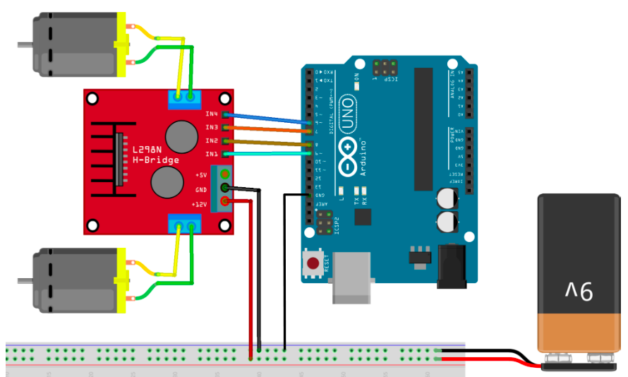
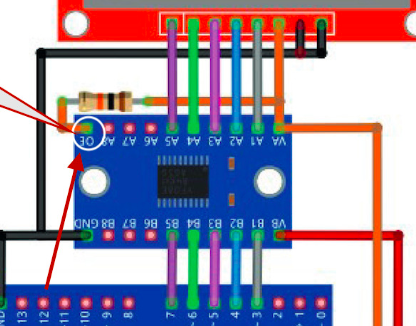
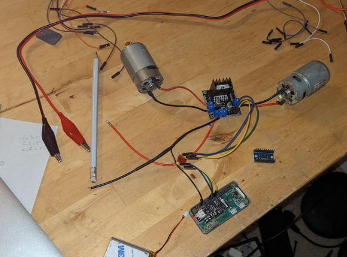

# Pi L298n DC motor
Raspberry Pi controlling DC Motors Using Python With a L298N Driver

### The motor control

I used this hardware https://www.reichelt.de/entwicklerboards-motodriver2-l298n-debo-motodriver2-p202829.html

### Logic Level Converter

I need the Logic Level Converter because I have a Raspberry Pi Zero with 3.3V

### The whole setup

